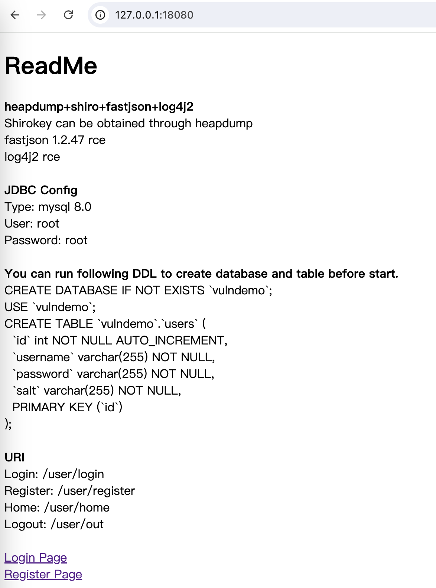

# VulnDemo

集成 **heapdump** + **shiro** + **fastjson** + **log4j2** 漏洞环境。

由于 heapdump 泄漏 shirokey 的实战环境难得，写了一个 demo 功能完成复现，另外增加 fastjson 1.2.47 与 log4j2 漏洞便于有需要的师傅调试学习。

## 环境说明

本环境集成 heapdump、shiro、fastjson 1.2.47、log4j2 漏洞。

- shiro 版本为 1.9.0，非硬编码密钥，可通过分析 heapdump 获取 shirokey 完成 rce。
- fastjson 默认为 1.2.47 版本常规 rce。
- log4j2 常规 rce。

**数据库配置** 与 **URI 信息**可启动后访问 **index.html** 查看，与本 README 提供信息相同。



### 开发环境

JDK：8u65

maven：3.6.3

### 数据库配置

本环境默认使用 **mysql 8.0** ，用户名 **root **，密码 **root** ，数据库 **vulndemo **。如果需要可自行修改 **application.yaml** 中的配置。

由于 demo 实现简单的用户**登录**、**注册**功能，需要在启动前创建 **users** 表，可运行以下 **DDL** 进行创建。

```
CREATE DATABASE IF NOT EXISTS `vulndemo`;
USE `vulndemo`;

CREATE TABLE `vulndemo`.`users` (
  `id` int NOT NULL AUTO_INCREMENT,
  `username` varchar(255) NOT NULL,
  `password` varchar(255) NOT NULL,
  `salt` varchar(255) NOT NULL,
  PRIMARY KEY (`id`)
);
```

### URI 信息

登录页：/user/login

注册页：/user/register

用户页面：/user/home

登出：/user/logout

Druid：/druid/

## 漏洞复现

命令行启动。

```
java -jar VulnDemo-1.0-SNAPSHOT.jar
```


服务默认开启 18080 端口。


登录页。


注册页，注册时不可重名。


登录后可访问用户页，展示用户 id、username。


### Shiro-rce

本环境 shiro 采用 1.9.0，未硬编码密钥，无法爆破出 shirokey。


环境存在 actuator 端点泄漏，env 中无明显 shirokey 字段。


访问 /actuator/heapdump 可下载 heapdump 文件。


使用利用工具 **JDumpSpider** ，可获得内存中 shirokey。这里不知道为什么会有两个，能打就行...


直接使用现成工具利用即可。


### Fastjson-rce

本环境登录注册功能后端使用 **fastjson 1.2.47** 解析 json，无特殊处理，直接利用调试即可。


### Log4j2-rce

本环境后端采用 log4j2 记录日志，登录注册功能均可触发。


